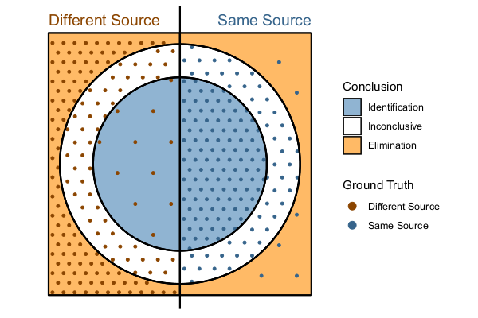
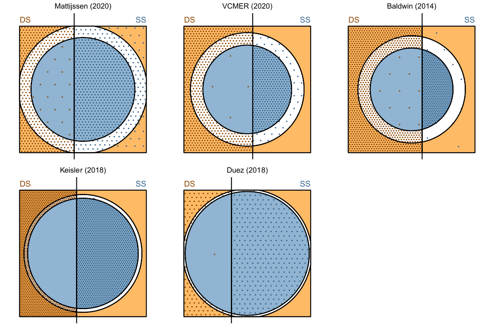

```{r data, include = F}
clopper <- function(alpha, success, trials) {
  lower <- qbeta(alpha/2, success, trials-success+1)
  upper <- qbeta(1-alpha/2, success+1, trials-success)
  c(lower, upper)
}

library(tidyverse) 
studies <- read.csv("data/studies.csv")
studies <- studies %>% mutate(
    Study = factor(Study, 
                   levels = c("Bunch (2003)", "Lyons (2009)", "Hamby (2019)", "Baldwin (2014)", "Keisler (2018)", "Duez (2018)", "VCMER (2020)", "Mattijssen (2020)", "FAID09 (2013) Bull.", "FAID09 (2013) Cartr."))
  )

cis <- studies %>% group_by(Study, Decision, Training) %>% 
  filter(Type == "Observed") %>%
  summarize(
    pred_ss = sum(Number[Ground.truth=="Same Source"])/sum(Number),
    pred_ss_lower = clopper(0.05, sum(Number[Ground.truth=="Same Source"]), sum(Number))[1],
    pred_ss_upper = clopper(0.05, sum(Number[Ground.truth=="Same Source"]), sum(Number))[2]
  )

source_spec_cis <- studies %>% group_by(Study, Ground.truth) %>% 
  filter(Type == "Observed") %>%
  mutate(
    pred_ss = Number/sum(Number),
    pred_ss_lower = map2_dbl(Number, sum(Number), ~clopper(0.05, .x, .y)[1]),
    pred_ss_upper = map2_dbl(Number, sum(Number), ~clopper(0.05, .x, .y)[2])
  )

exp <- studies %>% 
#  filter(Decision == "Inconclusive") %>%
  group_by(Study, Decision, Training) %>% 
  summarize(
    exp_ss = Number[Type=="Expected"][1] * sum(Number[Type == "Observed"]),
    exp_ss_lower = clopper(0.05, exp_ss, sum(Number[Type == "Observed"]))[1],
    exp_ss_upper = clopper(0.05, exp_ss, sum(Number[Type == "Observed"]))[2],
    exp_prob = exp_ss/sum(Number[Type == "Observed"])
  ) 
  
DontKnow_source_spec <- tibble(
  pred_ss = 0.5, 
  xmin=c(0,0,0,0,0,0), 
  xmax=c(1,1,1,1,1,1), 
  Study = c("Lyons (2009)", "Hamby (2019)", "Lyons (2009)", "Hamby (2019)", "Lyons (2009)", "Hamby (2019)") %>% factor(levels = levels(studies$Study)), 
  Training="US/CA",
  Decision=rep(c("Identification", "Inconclusive", "Elimination"), each=2),
  Ground.truth = "Different Source") %>%
  dplyr::mutate(Decision = factor(Decision, levels=c("Identification", "Inconclusive", "Elimination")))

DontKnow <- data.frame(
  pred_ss = 0.5, 
  xmin=c(0,0,0,0), 
  xmax=c(1,1,1,1), 
  Study = c("Lyons (2009)", "Hamby (2019)", "Lyons (2009)", "Hamby (2019)") %>% factor(levels = levels(studies$Study)), 
  Decision=rep(c("Inconclusive", "Elimination"), each=2))

errors <- studies %>% 
  mutate( # note, this is defining CORRECT decisions
    AFTE = (Ground.truth=="Same Source" & Decision != "Elimination") | 
      (Ground.truth=="Different Source" & Decision != "Identification"),
    Process = ((Ground.truth=="Same Source" & Decision == "Identification") | 
      (Ground.truth=="Different Source" & Decision == "Elimination")),
    Elimination = ((Ground.truth=="Same Source" & Decision == "Identification") | 
      (Ground.truth=="Different Source" & Decision %in% c("Inconclusive", "Elimination")))
         ) %>%
  group_by(Study,Training, Ground.truth) %>% 
  filter(Type == "Observed") %>%
  summarize(
    Comparisons = sum(Number),
    AFTE = sum(Number[!AFTE]),
    Process = sum(Number[!Process]),
    Elimination = sum(Number[!Elimination]),
    .groups = "drop_last"
  ) %>% 
  mutate(
    Error = c("Missed Elimination", "Missed Identification")[as.numeric(Ground.truth == "Same Source")+1]
  )
```

There were so many questions that we couldn't answer all of them, and many questions which touch on the same themes. We have combined and rephrased the questions to cover the essential topics which were covered in the Q&A. 

## Is the inconclusive rate related to the study difficulty?

<!-- It seems clear from these results that as difficulty increases so do inconclusives. Duez used test sets so easy as to be meaningless and Keisler was not far off from that (and so they have incredibly low rates), but FAID set out to use more difficult cw style samples (and so has a very high inconclusive rate), What should we make of that reality? -->

There is no doubt that we looked at several studies with different difficulty (as well as different study designs, comparison methods, and examiner populations). When we examine the AFTE error rate (so only eliminations of same-source comparisons, or identifications of different-source comparisons), compared to the rate of inconclusive decisions, we see that there is a clear difference between the studies conducted in Europe/UK and studies conducted in North America. 

```{r, echo = F, warning = F, fig.width=8, fig.height = 4}
library(ggrepel)
tmp <- errors %>%
  mutate(pct_inconcl = (Process - AFTE)/Comparisons,
         pct_error_afte = AFTE/Comparisons,
         pct_error_process = Process/Comparisons)

ggplot(tmp, aes(x = pct_error_afte, y = pct_inconcl)) + 
  geom_text_repel(aes(label = Study), color = "grey40", size = 2.5, data = filter(tmp, Training == "EU")) + 
  geom_point(aes(shape = Training)) + 
  scale_shape_manual("Training", values = c("US/CA" = 2, "EU" = 1)) + 
  facet_wrap(~Ground.truth + Error) + 
  scale_x_continuous(expand = expansion(mult = 0.1, add = 0), name = "AFTE Error Rate") + 
  scale_y_continuous("Proportion of Inconclusive Results") +
  theme_bw()

```

The EU/UK studies were conducted to assess lab proficiency (for the most part), and as a consequence, they seem to have been constructed to be able to distinguish good laboratories from excellent laboratories -- so they do include harder comparisons. But, the more notable result isn't the difference in the error rates, which is relatively small; rather, the largest difference is in the proportion of inconclusives in different-source and same source comparisons. In the EU/UK studies, the proportion of inconclusives is similar for both types of comparisons; in the US/CA studies, the proportion of inconclusives for same-source comparisons is a fraction of the proportion of inconclusives for different-source comparisons. 


<!-- HH: Those visualizations need a ton of explanation - either the explnations are included or the visualizations aren't -->

If we think about what study results should ideally look like, we might come up with something like this:



In this figure, there are many different-source eliminations and same-source identifications. There are equally many same-source and different-source inconclusives, and in both cases, erroneous decisions (same-source exclusions and different-source identifications) are relatively rare. The proportion of inconclusives might be greater or smaller, depending on the study difficulty or examiner experience levels, and the proportion of different-source and same-source identifications may be expected to vary some what depending on the study design (thus, the line down the center might shift to the left or the right). Ultimately, the entire study can be represented by this type of graphic showing the density of points in each region. 



When we actually look at the results of several studies, however, we see that none of them conform precisely to this expectation. As expected, the proportion of same-source and different-source decisions varies across the studies (Baldwin includes more DS comparisons, while Mattijssen includes more SS comparisons), and the proportion of inconclusive results differs, with more inconclusives in the top 3 studies relative to Keisler and Duez. However, the most notable difference is that the proportion of inconclusive results for different-source comparisons is much higher than the proportion of inconclusive results for same-source comparisons across studies. This discrepancy is less noticeable (but still present) for Mattijssen (2020), which was primarily completed by EU-trained examiners. In Baldwin, Keisler, and Duez, the proportion of different source comparisons judged inconclusive makes the inconclusive category appear as an extension of the elimination - the dots have approximately the same density, and the corresponding same-source inconclusive point density is so much lower that it is nearly unnoticeable in comparison. 


<!-- ** source quotes from the EU studies to show the studies aren't even similar in purpose ** -->

<!-- What we see when we examine this chart is that there is a clear difference in the studies in the EU/UK, compared to those conducted primarily in the US. In the US, there is a very large difference in the proportion of inconclusives for different-source comparisons (compared to inconclusives for same-source comparisons). In the EU/UK, the proportion of inconclusive results is relatively similar for both types of comparisons. There is not much evidence of a linear relationship between the proportion of inconclusives and the proportion of outright incorrect decisions. -->

The real story here seems to be that while studies that are more difficult do seem to have slightly higher error rates (which is expected), the training, location, and lab policies which influence examiner evaluations  has a real impact on the proportion of inconclusive decisions which are reached. The EU/UK studies provide some evidence for the fact that the bias in inconclusive error rates demonstrated in our paper is a solvable problem.

<!-- ** See also q6 answer... ** -->

## Examiners often report a final answer of "inconclusive", and this is correct according to the AFTE standard. Should inconclusives be allowed as a final answer?

From a statistical perspective, there is a mismatch between the state of reality (same source or different source) and the decision categories. This causes some difficulty when calculating error rates. We proposed multiple ways to handle this  situation: using predictive probabilities, distinguishing between process error and examiner error, or reframing the decision to one of identification or not-identification. Any of these options provides a much clearer interpretation of what an error is, and its relevance in legal settings.

In practice, we recognize that not all evidence collected will be suitable to reach a conclusion of identification or elimination, due to a number of different factors. These factors are often considered "process errors", and examiners are trained to account for these errors, and reach an inconclusive decision. We fully agree that this is a reasonable decision to make based on the circumstances; the issue with inconclusive decisions arises when results are presented in court, all of the errors which could contribute to the process are relevant. Thus, it is important to report the process error as well as the examiner-based (AFTE) error. 

In some cases, however, the examiner may have noted many differences at individual level, but be uncomfortable making an elimination (in some cases, due to lab policies prohibiting elimination based on individual characteristics). That there is hesitation to make this decision is an example of the bias we have demonstrated: when there is some evidence of similarity, examiners appear to be more willing to "bet" on a identification than on an elimination based on a similar amount of dissimilarity. This higher burden of proof is an issue that has consequences for the overall error rates reported from these studies, as well as the actual errors that may occur in the legal system itself. 

## How should courts prevent misused error rates?

The critical component to preventing misuse of error rates is to understand how error rates should be interpreted.  Currently, most error rates reported include inconclusives in the denominator but not in the numerator. As we have demonstrated in this paper (and in this Q&A), this approach leads to error rates that are misleadingly low for the overall identification process and not actionable in a legal situation. 
Instead, courts should insist on **predictive error rates**: given the examiner's **decision**, what is the probability that it resulted from a same-source or different-source comparison? These probabilities do not rely on inconclusives in the calculations, and are actually relevant to the specific result presented by the examiner in the trial at hand. 

<!-- From q8 -->

## What error rate should we use when?

The error rate we want is entirely dependent on the intended use: 

- In court, we should use predictive probabilities, because they provide specific information which relevant to the individual case under consideration.

- In evaluating examiners, the AFTE error rates, which do not include inconclusives, may be much more useful - they identify examiner errors, rather than errors which arise due to situation in which the evidence is recorded and collected. For labs it is of eminent concern that all of their examiners are adequately trained. 

It's very important to consider the context that an error rate or probability is used, and to calculate the error rate which is most appropriate for that context. 

<!-- From q16 -->

## Why do you claim AFTE treats inconclusives as correct results?

In the [AFTE response to the PCAST report](https://afte.org/uploads/documents/AFTE-PCAST-Response.pdf), the response specifically discusses false identifications and false eliminations, with no discussion of inconclusive results. Given that this is a foundational dispute, the way that AFTE presents these quantities in other literature is relevant, which is why we will demonstrate the problem with data pulled from AFTE's resources for error rate calculations. 


One of the documents offered by AFTE as a resource for error rates is 

> [CTS Results Revisited: A Review and Recalculation of the Peterson and Markham Findings, by: Bunch, Stephen.](https://afte.org/uploads/documents/swggun-cts-revisited.pdf)

We will use the numbers on the first and second page of this document to illustrate the problem: 

Truth | Identification | Inconclusive | Elimination | Total
----- | ----- | ----- | ----- | -----
Same Source | 905 | 43 | 17 | 965 
Different Source | 12 | 175 | 954 | 1141
Total | 917 | 218 | 971 | 2106


Bunch calculates the false positive error rate as 12/1141 = 1.05% and the false negative error rate as 17/965 = 1.76%. In both cases, the inconclusive decisions are included in the denominator (total evaluations) and not included in the numerator. This  means that when reporting error rates, the inconclusive decisions are never counted as errors -- implicitly, they are counted as correct in both cases. While he also reports the sensitivity, specificity, and inconclusive rate, none of these terms are labeled as "errors", which leads to the perception that the error rate for firearms examination is much lower than it should be. 

Suppose we exclude inconclusives from numerator and denominator. The false positive error rate using this approach would be 17/923 = 1.84%, and the false negative error rate would be 12/966 = 1.24% - in both cases, this results in a higher error rate, which demonstrates that the AFTE approach to inconclusives tends to produce misleading results. 

The current way errors are reported (when the reporter is being thorough) is to report the percentage of inconclusives in addition to the percentage of false eliminations and false identifications. Unfortunately, when this reporting process is followed, the discrepancy in inconclusive rates between same-source and different source comparisons is obscured. This hides a significant source of systematic bias. 

<!-- from 21 -->

## Are studies representative of casework?

First off, we can't know the answer to this question, because we can't ever know ground truth in casework. This is why we have to base everything we know on designed studies -- because ground truth is known. So we will never know whether the proportion of e.g. same source and different source comparisons in experiments is representative of casework. 

What we can know, but do not yet know, is the percentage of decisions that examiners reach that are inconclusive (or identification, or eliminations). We are not aware of any studies which report this data for any lab or jurisdiction; as a result, we do not know whether the proportion of inconclusive decisions is similar in case work and in designed studies. 

What we do know, however, is that the proportion of inconclusives is not constant between studies. In particular, there are much higher inconclusive rates for same-source comparisons in studies conducted in Europe and the UK. These studies are intended to assess a lab's skill, and are much harder than designed error rate studies in the US. So we know that the design and intent of a study does influence the inconclusive rate. More  research in this area is needed. 

One possibility for addressing the issue of different examiner behavior in studies vs. casework is to implement widespread blind testing -- testing in which the examiner is not aware they are participating in a study. The study materials would be set up to mimic evidence and the examiner would write their report as if it were an actual case. This would at least ensure that examiner behavior is similar in the study and in casework; however, this type of study is difficult to design and implement, which explains why it is not commonly done. 

In one respect, studies are much harder than casework: In casework, it is much more likely  that an elimination can be made on class characteristic mismatches alone. In designed studies, this is often not a scenario that is included -- so designed studies may in fact be harder overall, because they often examine consecutively manufactured (and thus more similar) firearms and toolmarks, all of which necessarily have the same class characteristics. 

<!-- from q9 and q10 and q15-->

## How do you get the predictive probability from a study?

It's important to note that you can only get the predictive probability from a designed study. This is because you need the proportion of same-source and different-source comparisons as baseline information. These proportions are only known in designed studies and are not at all known in casework. 
We have created a google sheet which can help calculate not only predictive probabilities but also the examiner and process error rates; the worksheet is available [here](https://docs.google.com/spreadsheets/d/10gupYPsflCDEbAWXywNnB3BJaNG4TVtQWOX-QJr4Ojk/edit?usp=sharing)

## Why not just exclude inconclusives from all calculations?

One reason is that inconclusive results are still reported in legal settings, but they are not equally likely when examining same-source and different-source evidence, which is informative. Given that an examiner reports an inconclusive result, the source is much more likely to be different than the same. By ignoring inconclusives entirely, we would be throwing out data that is informative. This argument has been made by Biedermann et al., but they did not take the assertion to its obvious conclusion. 

## What about lab policies that prohibit elimination on individual characteristics?

First, those policies are in direct conflict with the AFTE range of conclusions as published at https://afte.org/about-us/what-is-afte/afte-range-of-conclusions.
These guidelines specify "Significant disagreement of discernible class characteristics and/or individual characteristics." as a reason for an elimination. An interpretation by labs that does not a elimination based on individual characteristics should be addressed and clarified by AFTE.

Those policies also introduce bias into the examiner's decision. As can be seen from the rate at which inconclusive results stem from different-source comparisons in case studies - almost all inconclusive results are from different-source comparisons. Some studies controlled for this policy by asking participants to follow the same rules, and even in these studies, the same bias against same-source comparisons being labeled as inconclusive is present. This is true in Bunch & Murphy (conducted at the FBI lab, which has such a policy) and is also true in Baldwin, which was a much larger and more heterogeneous study that requested examiners make eliminations based on individual characteristic mismatches. 

## A finding of "no identification" could easily be misinterpreted by a non-firearms examiner, such as a juror or attorney, as an elimination. 

Under the status quo, an inconclusive can easily be framed as an almost-identification; so this ambiguity is already present in the system, and we rely on attorneys to frame the issue appropriately for the judge and/or jury. Under our proposal to eliminate inconclusives, we would also have to rely on attorneys to correctly contextualize the information presented by the examiner.


## You say that inconclusive results occur more frequently when the conclusion is different-source. Could a conviction really occur based on an inconclusive result? Why is this an issue?

Probably not, unless the testimony was something like: "I see a lot of similarities, but not quite enough to establish an identification". The framing of the inconclusive is important, and at the moment, there is no uniformity in how these results are reported.

<!-- ** may be duplicating above answers a bit ** -->